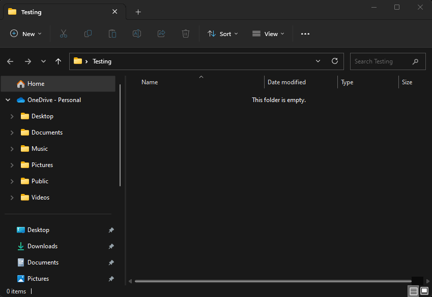

# Logo-Generator

## Table of Contents
 - [Description](#description)
 - [Installation](#installation)
 - [Usage](#usage)
 - [Contributing](#contributing)
 - [Testing](#testing)
 - [Questions](#questions)
 - [Contact](#contact)
 - [License](#license)

## Description
I wanted to make an easy-to-use logo generator that uses inquirer to prompt the user for a shape, color, text and text color, then generates an .svg file based on the input. My aim was to showcase my understanding of Jest and to make the project in a test-driven environment, so there are over ten tests that I wrote along the way to ensure functionality. Not much else to it, just enjoy and let me know what you think!

## Installation
Make sure to install node 16 lts and from the project directory run "npm install" in a terminal. This will install the necessary dependencies.

## Usage
  
From the project root directory, type "npm start" into a terminal and answer the following prompts. You may use hexadecimal or color name for each color choice. The resulting file will be saved to the project directory at /examples/logo.svg

## Contributing
Be good and do code

## Testing
Run "npm test" from the project directory and the tests provided should run. Any further tests can be added with jest. For more information read the documentation at https://www.npmjs.com/package/jest

## Questions
FAQ:
Q: Omg this is the best basic shape generator I've ever seen, how did you do? A: Well I woke up, ate my Wheaties and spent a few hours doing the thing. (<== sorry, dumb joke)

- GitHub Profile: [IkonicRes](https://github.com/IkonicRes)

- For additional questions, reach out to Ikonicresonance@gmail.com.

## Contact
Preferred method of communication: Github

## License

MIT License

    Permission is hereby granted, free of charge, to any person obtaining a copy of this software and associated documentation files (the "Software"), to deal in the Software without restriction, including without limitation the rights to use, copy, modify, merge, publish, distribute, sublicense, and/or sell copies of the Software, and to permit persons to whom the Software is furnished to do so, subject to the following conditions: The above copyright notice and this permission notice shall be included in all copies or substantial portions of the Software. THE SOFTWARE IS PROVIDED "AS IS", WITHOUT WARRANTY OF ANY KIND, EXPRESS OR IMPLIED, INCLUDING BUT NOT LIMITED TO THE WARRANTIES OF MERCHANTABILITY, FITNESS FOR A PARTICULAR PURPOSE AND NONINFRINGEMENT. IN NO EVENT SHALL THE AUTHORS OR COPYRIGHT HOLDERS BE LIABLE FOR ANY CLAIM, DAMAGES OR OTHER LIABILITY, WHETHER IN AN ACTION OF CONTRACT, TORT OR OTHERWISE, ARISING FROM, OUT OF OR IN CONNECTION WITH THE SOFTWARE OR THE USE OR OTHER DEALINGS IN THE SOFTWARE.

